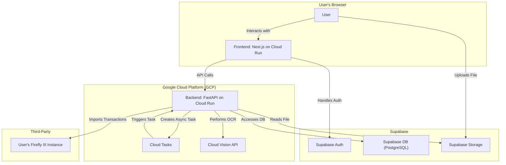
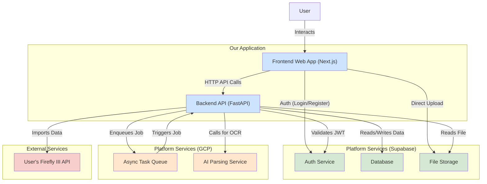
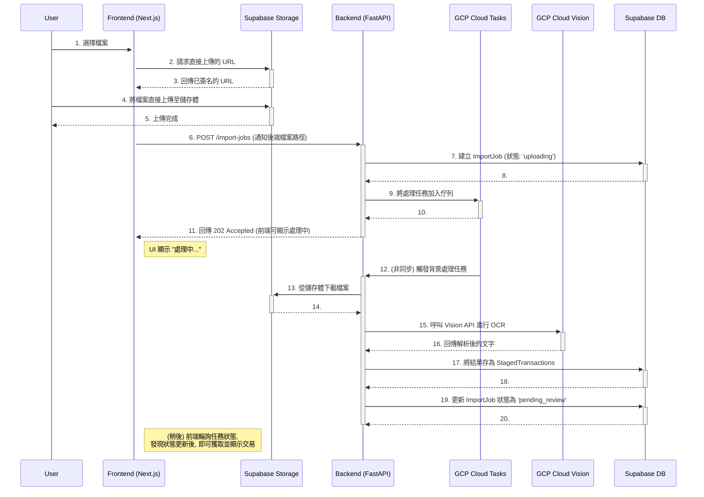

# Accountant Fullstack Architecture Document

### 1. Introduction

This document outlines the complete fullstack architecture for Accountant, including backend systems, frontend implementation, and their integration. It serves as the single source of truth for AI-driven development, ensuring consistency across the entire technology stack.

This unified approach combines what would traditionally be separate backend and frontend architecture documents, streamlining the development process for modern fullstack applications where these concerns are increasingly intertwined.

#### **1.1 Starter Template or Existing Project**

N/A - This is a Greenfield project. However, it will strictly follow the technical architecture defined in the Product Requirements Document (PRD), which specifies a stack including GCP, Supabase, FastAPI (Python), and a modern frontend framework like Next.js.

#### **1.2 Change Log**

| Date | Version | Description | Author |
| :--- | :--- | :--- | :--- |
| 2025-08-29 | 0.1 | Initial architecture draft based on PRD v1.0. | Winston, Architect |

### 2. High Level Architecture

#### **2.1 Technical Summary**

本專案將採用以 Google Cloud Platform (GCP) 和 Supabase 為核心的現代化無伺服器 (Serverless) 架構。前端將是一個使用 Next.js 開發的響應式 Web 應用，後端則是一個使用 Python/FastAPI 開發的輕量級 API 服務，兩者都將作為獨立的容器化服務部署在 GCP Cloud Run 上。Supabase 將提供資料庫、使用者身份驗證和檔案儲存功能。整個架構透過非同步任務 (GCP Cloud Tasks) 和外部 AI 服務 (GCP Cloud Vision) 的整合，旨在高效、經濟地實現 PRD 中定義的，從文件上傳到交易匯入的自動化核心流程。

#### **2.2 Platform and Infrastructure Choice**

*   **Platform:** Google Cloud Platform (GCP) & Supabase
*   **Key Services:**
    *   **GCP Cloud Run:** 用於託管無伺服器化的前端和後端應用。
    *   **GCP Cloud Vision API:** 用於文件的光學字元辨識 (OCR) 與解析。
    *   **GCP Cloud Tasks:** 用於管理和觸發耗時的背景文件處理任務。
    *   **Supabase Auth:** 用於處理使用者註冊、登入等身份驗證。
    *   **Supabase Database:** 一個全功能的 PostgreSQL 資料庫，用於儲存應用程式資料。
    *   **Supabase Storage:** 用於安全地儲存使用者上傳的財務文件。
*   **Deployment Host and Regions:** `asia-east1` (台灣) - 可根據目標使用者群調整。

#### **2.3 Repository Structure**

*   **Structure:** Monorepo (單一程式碼庫)
*   **Monorepo Tool:** `npm workspaces` (輕量、內建，適合 MVP)
*   **Package Organization:**
    *   `apps/web`: Next.js 前端應用。
    *   `apps/api`: FastAPI 後端應用。
    *   `packages/shared-types`: 用於存放前後端共享的 TypeScript 類型定義。

#### **2.4 High Level Architecture Diagram**



#### **2.5 Architectural Patterns**

*   **Serverless Architecture:** 核心計算層（前端和後端）將採用無伺服器模式，以實現自動擴展和按需付費，完美符合 MVP 階段的成本效益要求。
*   **Monorepo:** 所有程式碼（前端、後端、共享類型）都存放在單一的 Git 儲存庫中，以簡化依賴管理和跨端開發。
*   **Component-Based UI:** 前端將由獨立、可重複使用的 React 元件構成，以提升開發效率和可維護性。
*   **Asynchronous Task Processing:** 對於耗時的文件解析操作，將其放入背景任務佇列中處理，避免阻塞 API 和影響使用者體驗。
*   **Repository Pattern (Backend):** 我們將在後端引入倉儲模式，將資料庫的存取邏輯（對 Supabase 的操作）與核心業務邏輯分離，這使得未來更換資料庫或進行單元測試變得更加容易。

### 3. Tech Stack

#### **3.1 Technology Stack Table**

| Category | Technology | Version | Purpose | Rationale |
| :--- | :--- | :--- | :--- | :--- |
| **Frontend** | | | | |
| Frontend Language | TypeScript | 5.x | Type safety for JS | Industry standard for modern web development |
| Frontend Framework | Next.js | 14.x | Fullstack React framework | PRD recommendation, provides SSR, routing, etc. |
| UI Component Library | Material-UI (MUI) | 5.x | UI components | Professional look, good accessibility, integrates with React |
| State Management | React Context + Hooks | N/A | Manage global state | Built-in to React, sufficient for MVP needs |
| **Backend** | | | | |
| Backend Language | Python | 3.11+ | Core backend logic | PRD recommendation, excellent for data processing |
| Backend Framework | FastAPI | 0.110.x | Web API framework | PRD recommendation, high performance, modern |
| API Style | REST | N/A | Client-server communication | Standard, well-understood, native to FastAPI |
| **Data & Storage**| | | | |
| Database | PostgreSQL | 15.x | Primary data store | Provided by Supabase, powerful relational DB |
| Cache | N/A for MVP | - | Performance optimization | To adhere to zero-cost NFR, can add later |
| File Storage | Supabase Storage | N/A | User file uploads | Provided by Supabase, integrates with Auth/DB |
| **Authentication** | | | | |
| Authentication | Supabase Auth | N/A | User management | Provided by Supabase, includes JWT handling |
| **Testing** | | | | |
| Frontend Testing | Jest + RTL | Latest | Unit/Integration tests | Standard for Next.js, component-level testing |
| Backend Testing | Pytest | 8.x | Unit/Integration tests | Standard for Python/FastAPI ecosystem |
| E2E Testing | N/A for MVP | - | End-to-end validation | Explicitly out of scope in PRD to speed up MVP |
| **DevOps & Infra** | | | | |
| Build Tool | Next.js CLI / npm | Latest | Building/serving app | Comes with Next.js and Node.js ecosystem |
| Bundler | Turbopack / Webpack 5 | N/A | JS module bundling | Integrated into Next.js |
| IaC Tool | N/A for MVP | - | Infrastructure as Code | Manual setup for free tier, can add Terraform later |
| CI/CD | GitHub Actions | N/A | Automated builds/deploys | PRD recommendation, integrates with repository |
| Monitoring | GCP Monitoring / Supabase | N/A | Observability | Built-in to platforms, sufficient for MVP |
| Logging | GCP Logging / Supabase | N/A | Debugging/Tracing | Built-in to platforms, sufficient for MVP |
| **Styling** | | | | |
| CSS Framework | Emotion | 11.x | CSS-in-JS | Comes with MUI v5, enables dynamic styling |

### 4. Data Models

#### **4.1 Model: `Profile`**

*   **用途 (Purpose):** 儲存與使用者身份（由 Supabase Auth 管理）相關的公開設定檔資訊。
*   **關鍵屬性 (Key Attributes):**
    *   `id`: `UUID` - 主鍵，同時也是指向 `auth.users` 表的外鍵。
    *   `updated_at`: `Timestamp` - 最後更新時間。
    *   `username`: `String` - 使用者可選的公開顯示名稱。
*   **TypeScript Interface:**
    ```typescript
    // In packages/shared-types/src/profiles.ts
    export interface Profile {
      id: string; // Corresponds to Supabase user ID
      updated_at: string;
      username: string | null;
    }
    ```
*   **關聯 (Relationships):**
    *   與 `auth.users` 存在一對一的關聯。
    *   與 `FireflyConnection` (稍後定義) 存在一對一的關聯。

#### **4.2 Model: `ImportJob`**

*   **用途 (Purpose):** 代表一次完整的文件上傳與匯入任務，追蹤其從開始到結束的整個生命週期。
*   **關鍵屬性 (Key Attributes):**
    *   `id`: `UUID` - 主鍵。
    *   `created_at`: `Timestamp` - 任務建立時間。
    *   `user_id`: `UUID` - 指向 `Profile` 表的外鍵，標示任務擁有者。
    *   `file_path`: `String` - 在 Supabase Storage 中儲存的原始檔案路徑。
    *   `status`: `Enum` - 任務的目前狀態 (`uploading`, `parsing`, `pending_review`, `importing`, `completed`, `failed`)。
    *   `error_message`: `String` - 若任務失敗，則記錄錯誤訊息。
*   **TypeScript Interface:**
    ```typescript
    // In packages/shared-types/src/import-jobs.ts
    export type ImportJobStatus = 'uploading' | 'parsing' | 'pending_review' | 'importing' | 'completed' | 'failed';

    export interface ImportJob {
      id: string;
      created_at: string;
      user_id: string;
      file_path: string;
      status: ImportJobStatus;
      error_message: string | null;
    }
    ```
*   **關聯 (Relationships):**
    *   與 `Profile` 存在多對一的關聯。
    *   與 `StagedTransaction` 存在一對多的關聯。

#### **4.3 Model: `StagedTransaction`**

*   **用途 (Purpose):** 儲存從文件中解析出來、但尚未匯入 Firefly III 的單筆交易資料。這些資料等待使用者審核、編輯和對應。
*   **關鍵屬性 (Key Attributes):**
    *   `id`: `UUID` - 主鍵。
    *   `import_job_id`: `UUID` - 指向 `ImportJob` 的外鍵。
    *   `raw_text`: `String` - 從文件中提取的原始文字，用於追溯。
    *   `transaction_date`: `Date` - 交易日期。
    *   `description`: `String` - 交易描述。
    *   `amount`: `Decimal` - 交易金額。
    *   `currency`: `String` - 貨幣代碼 (e.g., "TWD")。
    *   `user_mappings`: `JSONB` - 儲存使用者手動選擇的對應關係（如 Firefly III 的帳戶 ID、分類 ID 等）。
*   **TypeScript Interface:**
    ```typescript
    // In packages/shared-types/src/staged-transactions.ts
    export interface StagedTransaction {
      id: string;
      import_job_id: string;
      raw_text: string;
      transaction_date: string;
      description: string;
      amount: number;
      currency: string;
      user_mappings: {
        source_account_id?: string;
        destination_account_id?: string;
        category_id?: string;
        tags?: string[];
      } | null;
    }
    ```
*   **關聯 (Relationships):**
    *   與 `ImportJob` 存在多對一的關聯。

#### **4.4 Model: `FireflyConnection`**

*   **用途 (Purpose):** 安全地儲存使用者個人 Firefly III 實例的 API 憑證。存取權杖在存入資料庫前，必須經過加密。
*   **關鍵屬性 (Key Attributes):**
    *   `user_id`: `UUID` - 主鍵，同時也是指向 `auth.users` 表的外鍵。
    *   `firefly_url`: `String` - 使用者 Firefly III 實例的 URL。
    *   `encrypted_access_token`: `String` - 經過加密的使用者個人存取權杖。
*   **TypeScript Interface:**
    ```typescript
    // In packages/shared-types/src/firefly.ts
    // Note: The full model with the token is backend-only.
    // This interface represents what the frontend might need.
    export interface FireflyConnectionInfo {
      url: string;
      is_connected: boolean;
    }
    ```
*   **關聯 (Relationships):**
    *   與 `Profile` 存在一對一的關聯。

#### **4.5 Model: `MappingRule`**

*   **用途 (Purpose):** 儲存一條使用者自訂的交易對應規則，以實現「訓練模式」的自動化功能。
*   **關鍵屬性 (Key Attributes):**
    *   `id`: `UUID` - 主鍵。
    *   `user_id`: `UUID` - 指向 `Profile` 表的外鍵，標示規則擁有者。
    *   `name`: `String` - 使用者為此規則設定的易記名稱（例如：「我的富邦卡規則」）。
    *   `trigger_keyword`: `String` - 用於觸發此規則的交易描述關鍵字（例如：「UBER」或「星巴克」）。
    *   `target_category_id`: `String` (可選) - 觸發後要自動對應的 Firefly III 分類 ID。
    *   `target_destination_account_id`: `String` (可選) - 觸發後要自動對應的 Firefly III 支出帳戶 ID。
*   **TypeScript Interface:**
    ```typescript
    // In packages/shared-types/src/mapping-rules.ts
    export interface MappingRule {
      id: string;
      user_id: string;
      name: string;
      trigger_keyword: string;
      target_category_id?: string;
      target_destination_account_id?: string;
    }
    ```
*   **關聯 (Relationships):**
    *   與 `Profile` 存在多對一的關聯。

### 5. API Specification

#### **5.1 REST API Specification (OpenAPI)**

```yaml
openapi: 3.0.1
info:
  title: Accountant API
  version: 1.0.0
  description: The API for the Accountant application, facilitating communication between the frontend and backend services.
servers:
  - url: /api/v1
    description: API Server

security:
  - bearerAuth: [] # All endpoints require authentication via Supabase JWT

paths:
  /firefly/connection:
    get:
      summary: Get Firefly III connection status
      responses:
        '200':
          description: Connection details (URL and connection status)
    post:
      summary: Save and test Firefly III connection credentials
      responses:
        '200':
          description: Connection successful
        '400':
          description: Connection failed (e.g., invalid credentials)

  /import-jobs:
    post:
      summary: Create a new import job after file upload
      responses:
        '202':
          description: Job accepted for processing
          content:
            application/json:
              schema:
                $ref: '#/components/schemas/ImportJob'

  /import-jobs/{jobId}:
    get:
      summary: Get the status and details of an import job
      parameters:
        - name: jobId
          in: path
          required: true
          schema:
            type: string
            format: uuid
      responses:
        '200':
          description: Job details
          content:
            application/json:
              schema:
                $ref: '#/components/schemas/ImportJob'

  /import-jobs/{jobId}/transactions:
    get:
      summary: Get the list of staged transactions for a job
      parameters:
        - name: jobId
          in: path
          required: true
          schema:
            type: string
            format: uuid
      responses:
        '200':
          description: A list of staged transactions
          content:
            application/json:
              schema:
                type: array
                items:
                  $ref: '#/components/schemas/StagedTransaction'

  /import-jobs/{jobId}/import:
    post:
      summary: Trigger the final import of transactions to Firefly III
      parameters:
        - name: jobId
          in: path
          required: true
          schema:
            type: string
            format: uuid
      responses:
        '200':
          description: Import completed successfully

  /staged-transactions/{transactionId}:
    put:
      summary: Update a single staged transaction with user mappings
      parameters:
        - name: transactionId
          in: path
          required: true
          schema:
            type: string
            format: uuid
      responses:
        '200':
          description: Transaction updated successfully

  /mapping-rules:
    get:
      summary: Get all mapping rules for the current user
      responses:
        '200':
          description: A list of mapping rules
    post:
      summary: Create a new mapping rule
      responses:
        '201':
          description: Rule created successfully

  /mapping-rules/{ruleId}:
    delete:
      summary: Delete a mapping rule
      parameters:
        - name: ruleId
          in: path
          required: true
          schema:
            type: string
            format: uuid
      responses:
        '204':
          description: Rule deleted successfully

  /firefly/accounts:
    get:
      summary: (Proxy) Get all asset and expense accounts from user's Firefly III
      responses:
        '200':
          description: A list of accounts

  /firefly/categories:
    get:
      summary: (Proxy) Get all categories from user's Firefly III
      responses:
        '200':
          description: A list of categories

components:
  securitySchemes:
    bearerAuth:
      type: http
      scheme: bearer
      bearerFormat: JWT
  schemas:
    ImportJob:
      type: object
      properties:
        id:
          type: string
          format: uuid
        created_at:
          type: string
          format: date-time
        status:
          type: string
          enum: [uploading, parsing, pending_review, importing, completed, failed]
        error_message:
          type: string
          nullable: true

    StagedTransaction:
      type: object
      properties:
        id:
          type: string
          format: uuid
        description:
          type: string
        amount:
          type: number
        transaction_date:
          type: string
          format: date
        user_mappings:
          type: object
          nullable: true
          properties:
            source_account_id:
              type: string
            destination_account_id:
              type: string
            category_id:
              type: string
```

### 6. Components

#### **6.1 Component List**

*   **元件 1: Frontend Web Application (Next.js)**
    *   **職責:** 提供完整的用戶介面 (UI)，處理使用者輸入，管理前端狀態，並與後端 API 進行通訊。
    *   **主要介面:** 向瀏覽器渲染 HTML/CSS/JS；向後端 API 發起 HTTP 請求；與 Supabase Auth 進行身份驗證；直接將檔案上傳至 Supabase Storage。
    *   **依賴:** Backend API, Supabase Auth, Supabase Storage。
    *   **技術:** Next.js, React, Material-UI。

*   **元件 2: Backend API (FastAPI)**
    *   **職責:** 透過 REST API 暴露核心業務邏輯。處理來自前端的請求，與資料庫互動，協調背景任務，並與外部 API 通訊。
    *   **主要介面:** 提供在 `api-spec` 中定義的 REST 端點。
    *   **依賴:** Supabase DB, Supabase Auth (用於驗證 JWT), GCP Cloud Tasks, GCP Cloud Vision API, 使用者的 Firefly III API。
    *   **技術:** Python, FastAPI。

*   **元件 3: Authentication Service (Supabase Auth)**
    *   **職責:** 管理使用者身份、註冊、登入和會話 (JWT)。
    *   **主要介面:** 為前端提供客戶端函式庫；為後端提供 JWT 驗證能力。
    *   **依賴:** 無 (此為基礎服務)。
    *   **技術:** Supabase (GoTrue)。

*   **元件 4: Database Service (Supabase DB)**
    *   **職責:** 為所有應用程式資料（如 Profiles, ImportJobs, MappingRules）提供持久化儲存。
    *   **主要介面:** 標準的 PostgreSQL 介面。
    *   **依賴:** 無。
    *   **技術:** Supabase (PostgreSQL)。

*   **元件 5: File Storage Service (Supabase Storage)**
    *   **職責:** 安全地儲存使用者上傳的財務文件。
    *   **主要介面:** 提供 S3 相容的 API，供前端上傳檔案、後端讀取檔案。
    *   **依賴:** Supabase Auth (用於存取策略)。
    *   **技術:** Supabase (S3)。

*   **元件 6: Async Task Queue (GCP Cloud Tasks)**
    *   **職責:** 管理耗時的文件處理任務佇列，確保它們在背景中被可靠地執行。
    *   **主要介面:** 透過 HTTP 推送 (push) 機制，觸發後端 API 的特定端點。
    *   **依賴:** Backend API。
    *   **技術:** GCP Cloud Tasks。

*   **元件 7: AI Parsing Service (GCP Cloud Vision)**
    *   **職責:** 對上傳的文件（PDF, 圖片）執行光學字元辨識 (OCR)，以提取原始文字。
    *   **主要介面:** REST API。
    *   **依賴:** 無 (此為外部服務)。
    *   **技術:** GCP Cloud Vision API。

#### **6.2 Component Diagrams**



### 7. External APIs

#### **7.1 API: Firefly III API**

*   **用途 (Purpose):** 將使用者審核過的交易匯入其個人的 Firefly III 實例中，並獲取帳戶、分類等資訊以供交易對應介面使用。
*   **文件 (Documentation):** [https://docs.firefly-iii.org/firefly-iii/api/](https://docs.firefly-iii.org/firefly-iii/api/)
*   **基礎 URL (Base URL):** 由使用者在設定中提供 (e.g., `https://firefly.example.com`)。
*   **身份驗證 (Authentication):** 使用者提供的個人存取權杖 (Personal Access Token)，作為 Bearer Token 包含在 `Authorization` 標頭中。
*   **速率限制 (Rate Limits):** 預設為 60 次/分鐘，需注意批次匯入時的處理方式。

**主要使用的端點 (Key Endpoints Used):**
*   `GET /api/v1/about` - 用於測試 API 連接的有效性。
*   `GET /api/v1/accounts?type=asset` - 獲取所有資產帳戶，用於「來源帳戶」的對應。
*   `GET /api/v1/accounts?type=expense` - 獲取所有支出帳戶，用於「目標帳戶」的對應。
*   `GET /api/v1/categories` - 獲取所有分類，用於「分類」的對應。
*   `POST /api/v1/transactions` - 建立一筆新的交易。

#### **7.2 API: Google Cloud Vision API**

*   **用途 (Purpose):** 對使用者上傳的 PDF 或圖片文件執行光學字元辨識 (OCR)，以提取結構化的文字內容。
*   **文件 (Documentation):** [https://cloud.google.com/vision/docs/reference/rest](https://cloud.google.com/vision/docs/reference/rest)
*   **基礎 URL (Base URL):** `https://vision.googleapis.com`
*   **身份驗證 (Authentication):** 使用後端服務管理的 GCP 服務帳號金鑰 (Service Account Key)。
*   **速率限制 (Rate Limits):** 預設為 1800 次/分鐘，遠高於我們 MVP 階段的需求。

**主要使用的端點 (Key Endpoints Used):**
*   `POST v1/files:asyncBatchAnnotate` - 非同步地處理文件（特別是多頁 PDF），並將結果輸出到指定的目的地（如 Google Cloud Storage），我們的後端將從該處讀取結果。

### 8. Core Workflows

#### **8.1 Workflow: Asynchronous Document Processing**



### 9. Database Schema

```sql
-- Profiles Table
-- Stores public user data, linked to Supabase's auth.users table.
CREATE TABLE public.profiles (
  id UUID PRIMARY KEY REFERENCES auth.users(id) ON DELETE CASCADE,
  updated_at TIMESTAMPTZ DEFAULT now(),
  username TEXT
);
-- RLS Note: Must be enabled. Users can only manage their own profile.


-- Firefly Connections Table
-- Stores encrypted credentials for Firefly III instances.
CREATE TABLE public.firefly_connections (
  user_id UUID PRIMARY KEY REFERENCES public.profiles(id) ON DELETE CASCADE,
  firefly_url TEXT NOT NULL,
  encrypted_access_token TEXT NOT NULL,
  created_at TIMESTAMPTZ DEFAULT now()
);
-- RLS Note: Must be enabled. Users can only manage their own connection.


-- Import Jobs Table
-- Tracks the lifecycle of each uploaded file.
CREATE TABLE public.import_jobs (
  id UUID PRIMARY KEY DEFAULT gen_random_uuid(),
  user_id UUID NOT NULL REFERENCES public.profiles(id) ON DELETE CASCADE,
  file_path TEXT NOT NULL,
  status TEXT NOT NULL DEFAULT 'uploading', -- e.g., uploading, parsing, pending_review, completed, failed
  error_message TEXT,
  created_at TIMESTAMPTZ DEFAULT now()
);
CREATE INDEX idx_import_jobs_user_id ON public.import_jobs(user_id);
-- RLS Note: Must be enabled. Users can only see their own jobs.


-- Staged Transactions Table
-- Stores transactions parsed from a document, awaiting user review.
CREATE TABLE public.staged_transactions (
  id UUID PRIMARY KEY DEFAULT gen_random_uuid(),
  import_job_id UUID NOT NULL REFERENCES public.import_jobs(id) ON DELETE CASCADE,
  raw_text TEXT,
  transaction_date DATE,
  description TEXT,
  amount NUMERIC(19, 4),
  currency VARCHAR(3),
  user_mappings JSONB, -- Stores user-defined mappings like account_id, category_id
  created_at TIMESTAMPTZ DEFAULT now()
);
CREATE INDEX idx_staged_transactions_import_job_id ON public.staged_transactions(import_job_id);
-- RLS Note: Must be enabled based on the job's user_id.


-- Mapping Rules Table
-- Stores user-defined rules for auto-mapping transactions.
CREATE TABLE public.mapping_rules (
  id UUID PRIMARY KEY DEFAULT gen_random_uuid(),
  user_id UUID NOT NULL REFERENCES public.profiles(id) ON DELETE CASCADE,
  name TEXT NOT NULL,
  trigger_keyword TEXT NOT NULL,
  target_category_id TEXT,
  target_destination_account_id TEXT,
  created_at TIMESTAMPTZ DEFAULT now()
);
CREATE INDEX idx_mapping_rules_user_id ON public.mapping_rules(user_id);
-- RLS Note: Must be enabled. Users can only manage their own rules.
```
