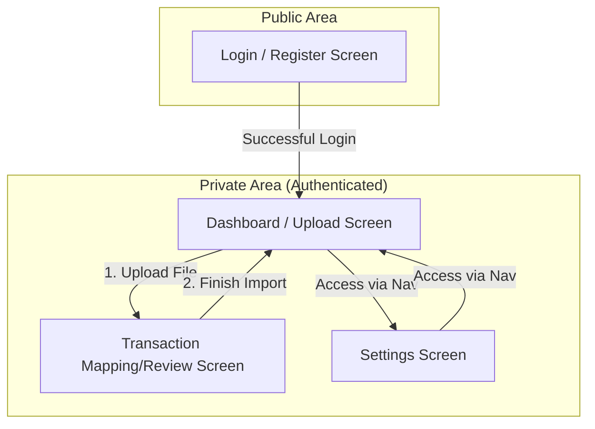
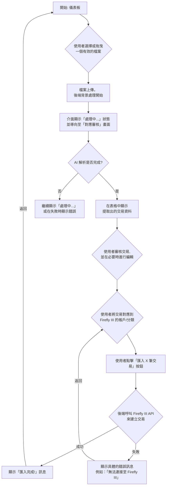

# Accountant UI/UX Specification

### Change Log

| Date | Version | Description | Author |
| :--- | :--- | :--- | :--- |
| 2025-08-29 | 0.1 | Initial draft based on PRD v1.0 | Sally, UX Expert |

### 1. Introduction
This document defines the user experience goals, information architecture, user flows, and visual design specifications for Accountant's user interface. It serves as the foundation for visual design and frontend development, ensuring a cohesive and user-centered experience.

#### **1.1 Overall UX Goals & Principles**

##### **Target User Personas**
*   **效率型理財者 (The Efficient Financier):** 這位使用者注重細節、追求效率與準確性。他們需要一個專業、可靠的工具來自動化繁瑣的記帳流程，並期望對整個過程有完全的掌控權。

##### **Usability Goals**
*   **清晰 (Clarity):** 介面和資訊必須一目了然，讓使用者能輕鬆理解目前的狀態和下一步操作。
*   **高效 (Efficiency):** 核心工作流程 (`上傳 -> 對應 -> 匯入`) 必須盡可能順暢，最大限度地減少使用者的點擊和等待時間。
*   **掌控感 (Control):** 使用者應感覺自己是整個流程的主導者，AI 是輔助他們的工具，而非相反。所有由 AI 自動完成的步驟都應是透明且可供使用者審核和修改的。

##### **Design Principles**
1.  **以工作流程為驅動 (Workflow-driven):** 介面應圍繞核心任務來組織，清晰地引導使用者完成每一步。
2.  **審核與修正優先 (Review and Correct First):** 系統主動呈現結果，使用者負責審核與修正，以此降低心智負擔。
3.  **漸進式揭露 (Progressive Disclosure):** 預設隱藏複雜性，只在當前步驟顯示必要的資訊和操作。
4.  **專業且值得信賴 (Professional & Trustworthy):** 視覺風格應簡潔、乾淨、現代，給人可靠的財務工具之感。
5.  **可及性設計 (Accessible by Default):** 從一開始就為所有使用者設計，確保符合 WCAG 2.1 AA 標準。

### 2. Information Architecture (IA)

#### **2.1 Site Map / Screen Inventory**



#### **2.2 Navigation Structure**

*   **主要導航 (Primary Navigation):**
    *   這將是使用者登入後，在應用程式頂部始終可見的導航列。
    *   建議包含以下連結：
        *   **儀表板 (Dashboard):** 將使用者帶回上傳檔案的主畫面。
        *   **設定 (Settings):** 連結至 Firefly III API 連接和規則管理的頁面。
        *   **登出 (Logout):** 結束使用者的會話。

*   **次要導航 (Secondary Navigation):**
    *   在 MVP 階段，我們可能不需要一個永久的次要導航。各個頁面的主要操作將內嵌在內容區域中。

*   **麵包屑導航策略 (Breadcrumb Strategy):**
    *   為了在多步驟流程中提供清晰的方向感，建議使用麵包屑導航。
    *   例如，在審核特定匯入任務時，麵包屑可能會顯示：`儀表板 > 匯入任務 #20250829-1`。

### 3. User Flows

#### **3.1 Flow: 端到端匯入流程 (End-to-End Import Workflow)**

*   **使用者目標 (User Goal):** 自動化處理一份財務報表（PDF 或圖片），並以最少的手動操作，將交易匯入到自己的 Firefly III 實例中。
*   **進入點 (Entry Points):** 使用者已登入，且位於「儀表板 / 上傳畫面」。
*   **成功標準 (Success Criteria):** 文件中的所有交易，都已按照使用者指定的對應關係（帳戶、分類等），被準確地建立在使用者的 Firefly III 實例中。

##### **Flow Diagram**



##### **邊界案例與錯誤處理 (Edge Cases & Error Handling):**

*   使用者上傳了不支援的檔案類型或過大的檔案。
*   AI 服務無法解析文件或回傳錯誤。
*   在對應階段，因網路或憑證問題，無法從 Firefly III 獲取帳戶/分類列表。
*   在最終匯入階段，Firefly III API 無法連線或拒絕了請求。
*   使用者在審核過程中意外關閉了瀏覽器。

#### **3.2 Flow: Firefly III 連接設定 (Firefly III Connection Setup)**

*   **使用者目標 (User Goal):** 安全地設定應用程式，使其能夠與自己個人的 Firefly III 實例進行通訊。
*   **進入點 (Entry Points):** 使用者已登入，並從主導航進入「設定」頁面。
*   **成功標準 (Success Criteria):** 應用程式確認使用者提供的 API URL 和個人存取權杖是有效的，可以成功連接，並將這些憑證安全地儲存起來。

##### **Flow Diagram**

```mermaid
graph TD
    A[開始: 使用者進入設定頁面] --> B{使用者填寫 Firefly III<br>的 URL 和個人存取權杖};
    B --> C[使用者點擊「儲存並測試連接」];
    C --> D{前端將憑證傳送至後端};
    D --> E{後端加密權杖<br>並嘗試呼叫測試 API<br>(例如 /api/v1/about)};
    E -- 成功 (200 OK) --> F[後端將加密後的<br>憑證儲存至資料庫];
    F --> G[後端回傳「成功」狀態];
    G --> H[介面顯示「連接成功」<br>並遮蔽權杖欄位];
    E -- 失敗 (如 401, 404, 超時) --> I[後端「不」儲存任何憑證];
    I --> J[後端回傳「失敗」狀態<br>及具體的錯誤原因];
    J --> K[介面顯示「連接失敗」<br>及原因，例如：「無效的權杖」];
    K --> B;
```

##### **邊界案例與錯誤處理 (Edge Cases & Error Handling):**

*   使用者輸入了格式不正確的 URL。
*   提供的 URL 無法訪問（例如，地址錯誤、伺服器關閉）。
*   個人存取權杖不正確或權限不足。
*   連接請求超時。
*   權杖正確，但 Firefly III 的版本不相容。

### 4. Wireframes & Mockups

*   **主要設計檔案 (Primary Design Files):** [Placeholder for Figma Project Link](https://www.figma.com/file/your-project-id/Accountant-UI-Design)

#### **4.1 Key Screen Layouts**

##### **Screen: 儀表板 / 上傳畫面 (Dashboard / Upload Screen)**

*   **用途 (Purpose):** 使用者登入後的主要入口。讓使用者可以開始一個新的匯入任務，並查看近期的匯入歷史。
*   **關鍵元素 (Key Elements):**
    *   一個顯眼的檔案上傳區（支援拖放和點擊選擇）。
    *   關於支援檔案類型（PDF, JPG, PNG）的清晰說明。
    *   一個近期匯入任務的列表或表格，包含其狀態（例如：「已完成」、「處理中」、「失敗」）。
    *   頂部的主導航列（儀表板、設定、登出）。
*   **互動說明 (Interaction Notes):** 檔案上傳後，應立即顯示上傳進度，並在完成後自動導向至「交易對應/審核」畫面。

##### **Screen: 交易對應/審核畫面 (Transaction Mapping/Review Screen)**

*   **用途 (Purpose):** 核心的「工作台」，使用者在此處審核、編輯和對應交易，然後執行最終匯入。
*   **關鍵元素 (Key Elements):**
    *   摘要標題（例如：「在 `statement.pdf` 中找到了 15 筆交易」）。
    *   一個顯示所有提取出交易的資料表格。欄位應包含：日期、描述、金額、來源帳戶、目標帳戶、分類、標籤。
    *   每一筆交易的欄位都應是可編輯的。
    *   用於對應的下拉選單（來源/目標帳戶、分類），其選項需從使用者的 Firefly III 動態載入。
    *   一個主要的行動號召按鈕（例如：「將 X 筆交易匯入至 Firefly III」）。
    *   批次處理功能（例如，「全選」核取方塊和「將分類套用至已選項目」的按鈕）。
    *   一個只在偵測到加密 PDF 時才出現的密碼輸入框。
*   **互動說明 (Interaction Notes):** 當使用者修改任何欄位時，應有清楚的視覺提示（例如，變更的欄位背景變色），以標示其為手動修改過的資料。

##### **Screen: 設定畫面 (Settings Screen)**

*   **用途 (Purpose):** 讓使用者可以管理他們與 Firefly III 的連接，以及他們儲存的匯入規則。
*   **關鍵元素 (Key Elements):**
    *   一個用於設定 Firefly III 連接的表單（URL、個人存取權杖），附有一個「儲存並測試連接」按鈕和清晰的狀態指示器。
    *   一個「我的規則」區塊。
    *   一個已儲存規則的列表，每一條規則都應顯示其名稱，並附有一個「刪除」按鈕。
*   **互動說明 (Interaction Notes):** 存取權杖（Token）在儲存後，應始終被遮蔽（例如 `••••••••`），以確保安全。

### 5. Component Library / Design System

*   **設計系統方法 (Design System Approach):**
    *   我們將採用一個現有的、成熟的 UI 元件庫：**Material-UI (MUI) for React**。
    *   **理由:** 這能極大地加快前端開發速度，確保視覺和互動的一致性，並提供開箱即用的可及性（Accessibility）功能，與我們的產品目標高度一致。我們將對其預設主題進行客製化，以符合我們的品牌風格。

#### **5.1 Core Components**

以下是實現我們已定義的關鍵畫面所需的核心元件列表：

*   **按鈕 (Button):**
    *   **用途:** 用於所有可操作的元素，如「匯入」、「儲存」、「刪除」。
    *   **變體:** 主要按鈕 (Primary CTA)、次要按鈕、文字按鈕。
    *   **狀態:** 預設 (default), 懸停 (hover), 禁用 (disabled), 載入中 (loading)。

*   **輸入框 (Text Field):**
    *   **用途:** 用於所有表單輸入，如登入、設定、密碼。
    *   **狀態:** 預設 (default), 懸停 (hover), 焦點 (focus), 錯誤 (error), 禁用 (disabled)。

*   **資料表格 (Data Grid):**
    *   **用途:** 「交易對應/審核」畫面的核心，用於展示和編輯交易資料。
    *   **需求:** 需支援排序、多選、以及欄位內聯編輯 (inline editing)。

*   **下拉選單 (Select):**
    *   **用途:** 用於將交易對應到 Firefly III 的帳戶和分類。
    *   **需求:** 需支援在長列表中進行搜尋和過濾。

*   **檔案上傳區 (File Upload Zone):**
    *   **用途:** 儀表板上的核心功能，用於上傳檔案。
    *   **需求:** 需支援拖放 (drag-and-drop) 和點擊選擇。

*   **應用程式頂欄 (App Bar):**
    *   **用途:** 放置主要導航連結（儀表板、設定）和使用者資訊/登出按鈕。

*   **提示訊息 (Alert / Snackbar):**
    *   **用途:** 顯示非阻斷式的回饋，如「連接成功」、「匯入已開始」。

*   **進度指示器 (Progress Indicator):**
    *   **用途:** 顯示載入狀態，如檔案上傳、AI 處理、最終匯入等。

*   **對話方塊 (Dialog / Modal):**
    *   **用途:** 用於需要使用者確認的操作（如「您確定要刪除此規則嗎？」）或顯示重要的結果訊息。

### 6. Branding & Style Guide

#### **6.1 Visual Identity**

*   **品牌指南 (Brand Guidelines):** 目前沒有正式的品牌指南。本文件將根據 PRD 中定義的原則，建立初始的風格方向。
*   **核心風格:** 專業、乾淨、現代、值得信賴。避免使用花俏或分散注意力的視覺元素。

#### **6.2 Color Palette**

| Color Type | Hex Code | Usage |
| :--- | :--- | :--- |
| Primary | `#2563EB` (藍色) | 主要按鈕、連結、焦點狀態等核心互動元素 |
| Secondary | `#475569` (深灰色) | 次要按鈕、次要文字 |
| Accent | `#F59E0B` (琥珀色) | 用於需要特別突顯的元素，謹慎使用 |
| Success | `#10B981` (綠色) | 成功訊息、驗證通過 |
| Warning | `#FBBF24` (黃色) | 警告提示、需要使用者注意的資訊 |
| Error | `#EF4444` (紅色) | 錯誤訊息、破壞性操作的確認 |
| Neutral | `#F8FAFC` (背景), `#E2E8F0` (邊框), `#334155` (內文), `#0F172A` (標題) | 文字、邊框、背景 |

#### **6.3 Typography**

*   **字體家族 (Font Families):**
    *   **主要字體 (Primary):** `Inter`, `system-ui`, `-apple-system`, `sans-serif` (一組現代、高可讀性的無襯線字體)
*   **字體層級 (Type Scale):**
| Element | Size | Weight | Line Height |
| :--- | :--- | :--- | :--- |
| H1 | 2.25rem (36px) | 700 (Bold) | 1.2 |
| H2 | 1.875rem (30px) | 700 (Bold) | 1.3 |
| H3 | 1.5rem (24px) | 600 (Semi-bold) | 1.4 |
| Body | 1rem (16px) | 400 (Regular) | 1.6 |
| Small | 0.875rem (14px) | 400 (Regular) | 1.5 |

#### **6.4 Iconography**

*   **圖示庫 (Icon Library):** **Material Icons (Outlined)** - 為了與我們選擇的 MUI 元件庫保持風格一致。
*   **使用指南 (Usage Guidelines):** 圖示應主要用於增強辨識度，而非作為裝飾。每個圖示的使用都應有其明確的功能目的。

#### **6.5 Spacing & Layout**

*   **網格系統 (Grid System):** 我們將採用業界標準的 **8px 間距系統**。所有元件的尺寸和它們之間的間距，都應是 8 的倍數（例如 8px, 16px, 24px, 32px）。

### 7. Accessibility Requirements

#### **7.1 Compliance Target**

*   **標準 (Standard):** **WCAG 2.1 Level AA**。這是我們為確保產品可及性而設定的最低標準。

#### **7.2 Key Requirements**

##### **視覺 (Visual):**

*   **色彩對比度 (Color Contrast):** 所有文字與其背景的對比度，必須至少達到 4.5:1，以確保可讀性。
*   **焦點指示器 (Focus Indicators):** 所有可互動的元素（如連結、按鈕、輸入框）在透過鍵盤（如 Tab 鍵）選中時，都必須有清晰可見的視覺外框。
*   **文字縮放 (Text Sizing):** 使用者應能夠在瀏覽器中將文字放大至 200% 而不會破壞頁面佈局或導致功能喪失。

##### **互動 (Interaction):**

*   **鍵盤導覽 (Keyboard Navigation):** 使用者必須能夠僅使用鍵盤，就能訪問和操作應用程式的所有功能。
*   **螢幕閱讀器支援 (Screen Reader Support):** 應用程式的結構和內容必須能被主流的螢幕閱讀器（如 NVDA, VoiceOver）正確地解析和朗讀。
*   **觸控目標 (Touch Targets):** 在行動裝置上，所有可點擊的目標（如按鈕、連結）的尺寸，必須至少為 44x44 像素，以避免誤觸。

##### **內容 (Content):**

*   **替代文字 (Alternative Text):** 所有非純裝飾性的圖片（如 Logo），都必須提供描述性的 `alt` 文字。
*   **標題結構 (Heading Structure):** 頁面必須使用邏輯正確的標題層級（`<h1>`, `<h2>`, `<h3>` 等），以建立清晰的內容大綱。
*   **表單標籤 (Form Labels):** 所有的表單輸入框，都必須有與之程式化關聯的、清晰可見的 `<label>`。

#### **7.3 Testing Strategy**

*   **自動化測試:** 在 CI/CD 流程中整合自動化可及性掃描工具（如 `axe-core`），以捕捉常見的違規問題。
*   **手動測試:** 定期執行手動測試，特別是：
    *   完整的鍵盤導覽測試（嘗試僅用 Tab, Shift+Tab, Enter, Space 等按鍵完成核心流程）。
    *   使用螢幕閱讀器（如 NVDA 或 VoiceOver）來走查核心的使用者流程。

### 8. Responsiveness Strategy

#### **8.1 Breakpoints**

我們將採用一個標準的、以行動裝置優先的斷點系統。

| Breakpoint | Min Width | Target Devices |
| :--- | :--- | :--- |
| Mobile (手機) | 0px | 典型智慧型手機 (直向) |
| Tablet (平板) | 768px | 平板裝置 (直向與橫向) |
| Desktop (桌面) | 1024px | 筆記型電腦與一般桌面螢幕 |
| Wide (寬螢幕) | 1440px | 大型桌面螢幕 |

#### **8.2 Adaptation Patterns**

*   **佈局變化 (Layout Changes):**
    *   **桌面 (Desktop):** 採用多欄式佈局，以最大化資訊密度和操作效率。
    *   **手機 (Mobile):** 轉換為單欄式佈局。所有內容區塊將垂直堆疊，以確保在狹窄的螢幕上也能清晰閱讀和操作。

*   **導覽變化 (Navigation Changes):**
    *   **桌面 (Desktop):** 頂部導覽列會完整顯示「儀表板」、「設定」等連結。
    *   **手機 (Mobile):** 頂部導覽列將會折疊成一個「漢堡選單」圖示，點擊後才會展開導覽選項。

*   **內容優先級 (Content Priority):**
    *   在所有裝置上，核心工作流程的內容（如檔案上傳區、交易列表）都將被置於最優先的位置。
    *   在手機上，次要的資訊或控制項，可能會被預設隱藏在「顯示更多」的切換按鈕之後。

*   **互動變化 (Interaction Changes):**
    *   **交易對應表格:** 這是響應式設計中最大的挑戰。
        *   **桌面 (Desktop):** 顯示為一個功能完整的資料表格 (Data Grid)，包含多個欄位，並支援批次選擇。
        *   **手機 (Mobile):** 資料表格將轉換為一個「卡片列表 (List of Cards)」。每一筆交易將以一張獨立的卡片呈現，卡片內垂直排列該交易的關鍵資訊和操作按鈕（如編輯、選擇分類）。這種佈局更適合觸控操作。

### 9. Animation & Micro-interactions

#### **9.1 Motion Principles**

*   **功能性優先 (Functional, not decorative):** 所有動效都必須有其目的，例如：提供回饋、引導注意力或平滑地過渡介面狀態。
*   **靈敏且高效 (Responsive and performant):** 動畫必須輕量且快速，不能影響應用的載入時間或互動效能。
*   **一致且可預測 (Consistent and predictable):** 相同的互動應在整個應用中觸發相同的動效，以建立一致的使用者預期。

#### **9.2 Key Animations**

我們將專注於以下幾種微妙但高效的微交互：

*   **狀態轉換 (State Transitions):**
    *   **描述:** 當按鈕、連結、輸入框等互動元素在不同狀態（如：預設、懸停、焦點、禁用）之間切換時，應有平滑的顏色或陰影過渡效果。
    *   **參數:** 持續時間: 150ms, 緩動函式: `ease-out`。

*   **載入指示器 (Loading Indicators):**
    *   **描述:** 在進行非同步操作（如檔案上傳、AI 解析、匯入）時，應使用持續的進度指示器（如旋轉的圓圈或移動的進度條）來告知使用者系統正在工作中。

*   **元素的出現與消失 (Element Entry/Exit):**
    *   **描述:** 當提示訊息 (Alerts/Snackbars) 或對話方塊 (Modals) 出現或消失時，應使用淡入/淡出的效果，而不是突然地跳入或消失。
    *   **參數:** 持續時間: 200ms, 緩動函式: `ease-in-out`。

*   **展開與折疊 (Expand/Collapse):**
    *   **描述:** 用於手機上的漢堡選單或未來可能出現的可展開/折疊的內容區塊。應使用平滑的高度變化動畫。
    *   **參數:** 持續時間: 250ms, 緩動函式: `ease-in-out`。

### 10. Performance Considerations

#### **10.1 Performance Goals**

*   **頁面載入 (Page Load):** 核心頁面的最大內容繪製時間 (LCP) 應小於 2.5 秒。
*   **互動響應 (Interaction Response):** 使用者操作（如點擊按鈕、輸入文字）的介面響應時間，應小於 100 毫秒。
*   **背景任務 (Background Task):** 根據 PRD 要求，從檔案上傳到 AI 解析完成的端到端時間，應控制在 60 秒以內。

#### **10.2 Design Strategies**

*   **骨架屏 (Skeleton Screens):** 在等待資料載入時（例如，從後端獲取交易列表），應顯示頁面佈局的骨架版本，以提升感知效能。
*   **列表虛擬化 (List Virtualization):** 對於「交易對應」畫面，如果交易數量可能非常多，我們需要採用虛擬化或窗口化技術，只渲染可視區域內的列表項，以確保滾動的流暢性。
*   **程式碼分割 (Code Splitting):** 依賴前端框架（如 Next.js）的功能，確保使用者在訪問特定頁面時，只下載該頁面所需的程式碼。
*   **延遲加載 (Lazy Loading):** 非首屏的圖片或元件，應在使用者即將滾動到它們時才開始載入。

### 11. Next Steps

#### **11.1 Immediate Actions**
1.  將此規格書分享給所有專案利害關係人（產品、開發）進行最終審核與批准。
2.  基於此文件定義的線框圖和風格指南，在 Figma 中開始建立高保真視覺稿 (High-fidelity Mockups) 和互動原型。
3.  準備與開發團隊的設計交接會議，詳細解說此規格書與 Figma 設計稿。
4.  前端架構師可以開始根據此規格，撰寫詳細的前端架構文件。

#### **11.2 Design Handoff Checklist**
- [x] All user flows documented
- [x] Component inventory complete
- [x] Accessibility requirements defined
- [x] Responsive strategy clear
- [x] Brand guidelines incorporated
- [x] Performance goals established
